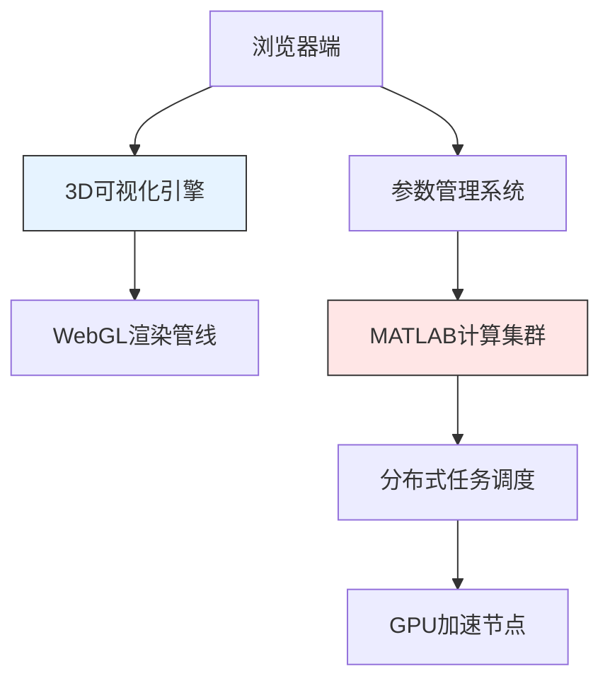
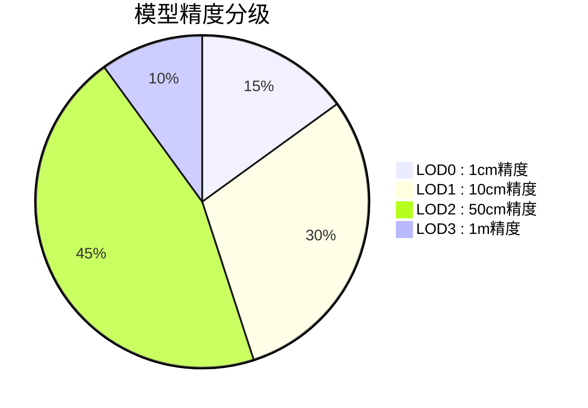
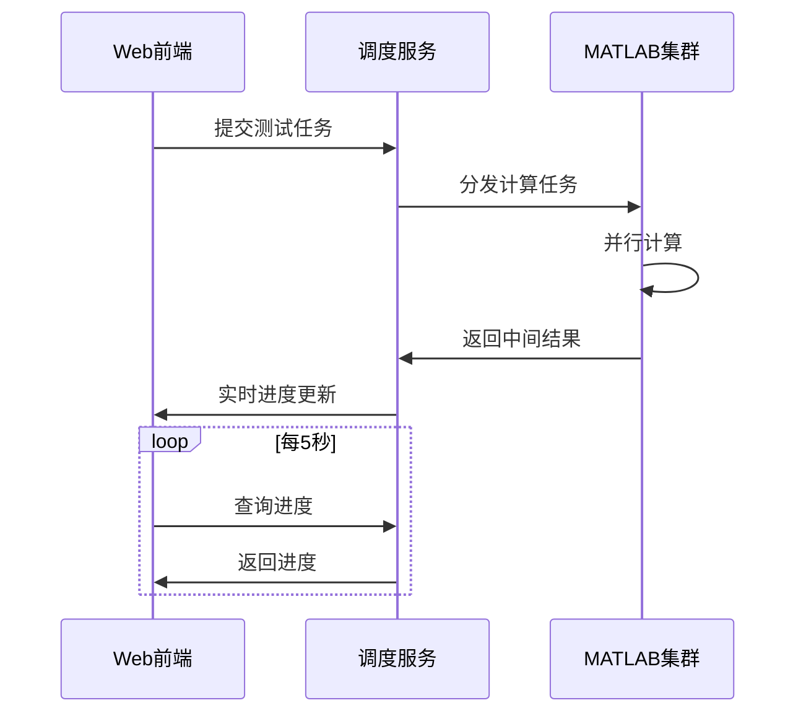
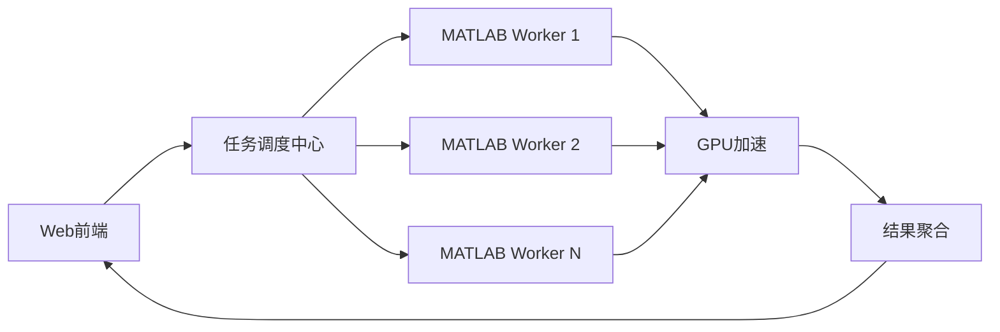
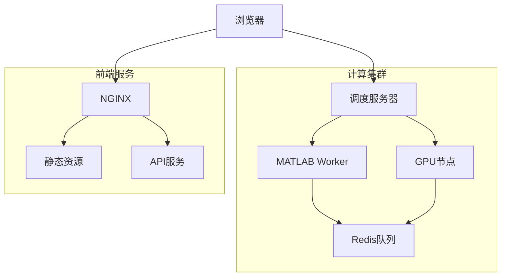

# 智慧城市 3D 仿真系统技术规格说明书

## 一、系统架构设计



## 二、核心功能指标

### 2.1 计算性能要求

| 场景                  | 目标值   | 测量条件             |
| --------------------- | -------- | -------------------- |
| 单建筑仿真            | ≤3 分钟  | 10 万三角面片模型    |
| 工业园区仿真（10 栋） | ≤25 分钟 | 分布式计算（4 节点） |
| 实时渲染帧率          | ≥60FPS   | 1080P 分辨率         |

### 2.2 可视化精度要求



### 2.3 性能测试方案



| 测试类型     | 测量指标         | 合格标准      |
| ------------ | ---------------- | ------------- |
| 压力测试     | 最大并发任务数   | ≥50 任务/分钟 |
| 内存泄漏测试 | 24 小时内存增长  | ≤5%           |
| 渲染性能测试 | 复杂场景帧率波动 | ≤±10%         |

## 三、模块化设计

### 3.1 分布式计算架构



### 3.2 计算引擎接口

````typescript
interface ComputeEngine {
  submitTask(config: SimulationConfig): Promise<TaskID>;
  getTaskProgress(id: TaskID): number;
  cancelTask(id: TaskID): void;
  exportResult(id: TaskID, format: 'JSON'|'CSV'): Blob;
}

### 3.3 3D引擎组件
```mermaid
classDiagram
    class SceneManager {
        +loadScene(config: SceneConfig)
        +registerPlugin(plugin: EnginePlugin)
        +executeRendering()
    }
    class RenderingPipeline {
        +setupPostProcessing()
        +applySSAO()
        +enableRayTracing()
    }
    class ModelLoader {
        +loadGLB(url: string): Promise<Mesh>
        +parseKMZ(data: ArrayBuffer): Scene
    }
    SceneManager "1" *-- "1" RenderingPipeline
    SceneManager "1" *-- "1..n" ModelLoader
    RenderingPipeline --> WebGLContext : 使用
    ModelLoader --> FileParser : 依赖
````

type SimulationConfig = {
buildings: BuildingProfile[];
material: MaterialProperties;
simulationType: 'raytracing' | 'heatmap';
};

````

2. **参数管理**
   - Web界面集中管理计算参数
   - 支持JSON模板导入/导出
   - 参数版本控制与差异对比

### 2.2 3D可视化需求
1. **基础功能**
   - KMZ文件解析与3D模型加载
   - 建筑模型交互操作（旋转/缩放/剖切）
   - 多视口对比展示（≤4个）

2. **专业功能**
   - 射线追踪仿真可视化
   - 信道特性热力图渲染
   - 建筑物LOD分级显示

3. **地图功能**
   - 基础地图服务集成
   - 建筑物/道路矢量数据编辑
   - 空间查询与分析工具

## 四、接口规范
### 4.1 渲染管线接口
```typescript
interface RenderPipeline {
  init(canvas: HTMLCanvasElement, options?: RenderOptions): Promise<void>;
  loadScene(sceneConfig: SceneConfig): Promise<SceneHandle>;
  createViewport(rect: DOMRect): ViewportHandle;
}

interface RenderOptions {
  antialias?: boolean;
  preserveDrawingBuffer?: boolean;
  powerPreference?: 'high-performance' | 'low-power';
}
````

### 4.2 模型加载接口

```mermaid
classDiagram
    ModelLoader <|-- GLTFLoader
    ModelLoader <|-- KMZLoader
    ModelLoader : +load(url)
    ModelLoader : +parse(data)
    class GLTFLoader {
        +loadTextures()
        +createMaterials()
    }
    class KMZLoader {
        +extractKMZ()
        +parseCollada()
    }
```

## 五、技术实现

### 5.1 前端架构

```markdown
- 技术栈：
  - 框架: React18 + TypeScript5
  - 构建: Vite5 + PNPM8
  - 3D 引擎: Babylon.js 6.x
- 仓库结构：
  /packages
  /core # 核心引擎
  /react # React 适配层  
   /vue # Vue 适配层
  /angular # Angular 适配层
  /examples # 示例项目
```

### 3.2 核心能力

1. **框架支持**

   - Web Components 原生支持
   - 多框架适配层（React/Vue/Angular）
   - 纯 JavaScript/TypeScript API

2. **扩展能力**
   - 可插拔 Shader 系统
   - 自定义模型加载器接口
   - Web Worker 并行计算支持

### 3.3 示例要求

1. **基础示例**

   - 多路由演示（React Router）
   - 基础场景搭建
   - 模型导入演示（GLB/KMZ）

2. **高级示例**
   - 自定义 Shader 效果
   - 射线追踪仿真
   - 多视口对比

## 四、工程规范

### 4.1 目录结构

## 五、部署架构



## 六、实施计划

```
.
├── packages/
│   ├── core/         # 核心引擎
│   ├── react/        # React适配层
│   ├── web-components/ # Web组件
│   └── examples/     # 示例项目
├── vite.config.ts    # 构建配置
└── pnpm-workspace.yaml
```

### 4.2 构建要求

| 模块类型 | 输出格式 | 目标环境   |
| -------- | -------- | ---------- |
| 核心库   | ESM      | 现代浏览器 |
| 适配层   | CommonJS | Node 环境  |
| 完整包   | UMD      | 全局变量   |

## 五、实施计划

### 5.1 基础搭建

1. 初始化 monorepo
2. 配置核心引擎基础场景
3. 实现 Web Components 基础组件

### 5.2 核心功能

1. KMZ 解析器开发
2. 射线追踪算法集成
3. MATLAB 计算桥接

### 5.3 示例项目

1. 多路由示例
2. 多框架集成演示
3. 性能测试场景
